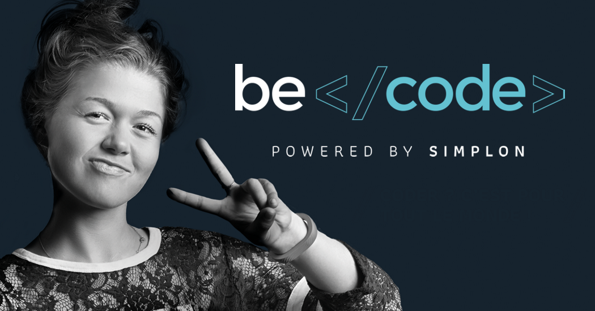

# BeCode Workshop

## How to BeCode :octocat:



At BeCode we help motivated people to become junior **web developers**.  
This means that during the **7 months** at BeCode we help you navigate the ever growing world of web development. 

Being a web developer means **never to stop learning**. There are a lot of brand new technologies out there and everyday new solutions for new problems are found. 
So at BeCode we don't teach, instead we help you find out how you can **teach yourself**.


## Let's code

Today I will introduce you to **HTML and CSS**, the two core building blocks of most webpages you visit. After the short introduction it's up to you to push yourself to discover more. 

In the beginning of the training I will give short introductions on the new technologies. As we progress further in the training there will be less information and it will be up to you to find information yourself.


### HTML

So what is HTML exactly? If we take a look at the [documentation](https://developer.mozilla.org/en-US/docs/Web/HTML) on MDN, we find the following explanation:

> HTML (HyperText Markup Language) is the most basic building block of the Web. It defines the meaning and structure of web content. Other technologies besides HTML are generally used to describe a web page's appearance/presentation (CSS) or functionality/behavior (JavaScript).

HTML gives **meaning and structure** to the content on your website. You do this by wrapping the content with the correct **tag**. There are [a lot of different tags](https://developer.mozilla.org/en-US/docs/Web/HTML/Element) and they all have a different meaning.


#### Try it yourself

Use the documentation on MDN to find the best tags for the following content:

<details><summary>The Title Of My Website</summary>

```
	<title>The Title Of My Website</title>
```

- The HTML title element defines the document's title that is shown in a browser's title bar or a page's tab.
</details>


<details><summary>Kon. Astridlaan 185, 9000 Gent</summary>

```
	<address>Kon. Astridlaan 185, 9000 Gent</address>
```

- The HTML address element indicates that the enclosed HTML provides contact information for a person or people, or for an organization.
</details>

<details><summary>Lorem ipsum dolor sit amet, consectetur adipiscing elit, sed do eiusmod tempor incididunt ut labore et dolore magna aliqua. [...] Excepteur sint occaecat cupidatat non proident, sunt in culpa qui officia deserunt mollit anim id est laborum.</summary>

```
	<p>Lorem ipsum dolor sit amet, consectetur adipiscing elit, sed do eiusmod tempor incididunt ut labore et dolore magna aliqua. [...] Excepteur sint occaecat cupidatat non proident, sunt in culpa qui officia deserunt mollit anim id est laborum.</p>
```

- The HTML p element represents a paragraph.
</details>


#### Some useful resources

- [HTML basics on MDN](https://developer.mozilla.org/en-US/docs/Learn/Getting_started_with_the_web/HTML_basics)
- [freecodecamp course](https://learn.freecodecamp.org/responsive-web-design/basic-html-and-html5)
- [html5doctor](http://html5doctor.com/)
- [CodeCademy course](https://www.codecademy.com/learn/learn-html)
- [Just google it !](google.com)

#### Challenge

Write our own about page:  
- Go to [codepen.io](https://codepen.io/pen), here you can create different 'pens' to **experiment with html, css and javascript.**  
- Write something about yourself, why your here, ... Add a **h1 tag**, a **header** and a **footer**.  
- Compare your about page with your neighbour. Did you use the same tags, and why (not)? **Discuss**!
- Try to add an image to your page.

### CSS

Now we know how to display content on a webpage, but if we would stop right now, all our webpages would look the same. **HTML** adds meaning and **structure** to your content, but does not change the appearance.

To change the **appearance** of the content we display on our webpage, we use **CSS**. 

CSS lets you apply styles selectively to elements in HTML documents. For example, to select all the paragraph elements on your about HTML page and turn the text within them red, you'd write this CSS:


#### Selectors

To style the html elements we use [**selectors**](https://developer.mozilla.org/en-US/docs/Learn/CSS/Introduction_to_CSS/Selectors). In the above example, we use the 'p' html tag as the selector. This will select all the content that is wrapped in 'p' tags and apply your CSS to them. This is called an **element selector**.

To select specific html elements you can use the **class selector**. Let's take a look at an example:


**HTML:** 
```
<h1 class="myClass"> Title </h1>
```

In the above example we added a **"class" attribute** to the h1 tag. We can now use this attribute to select this tag. We can now use this class to select this element in our CSS as follows:

**CSS:**
```
.myClass {
	color: red;
}
```

#### Useful resources

- [CSS on mdn](https://developer.mozilla.org/en-US/docs/Learn/Getting_started_with_the_web/CSS_basics)
- [CSS tricks almanac](https://css-tricks.com/almanac/)

#### CSS games

- [CSS Diner](http://flukeout.github.io/)  
- [Flexbox Froggy](http://flexboxfroggy.com/#nl)
- [Flexbox defense](http://www.flexboxdefense.com/)


#### Challenge

Add CSS to your html on codepen

- Add a class 'red' to your title to turn the text red.
- Use **descriptive names** for your classes.  
- Change the **background color** of the page.  
- Change the **font** of your title.  
- ...

Optional Challenge - A real webpage

- Download the [template](./files/template.zip) zip file  
- Open the index.html file in your editor of choice.  
- Replace the placeholder text with info about you / a made up company / ...  
- Add your own css file and make some changes.  
- Add images to your webpage.
- Finished and proud of your webpage? Talk to a coach to host your website online.


